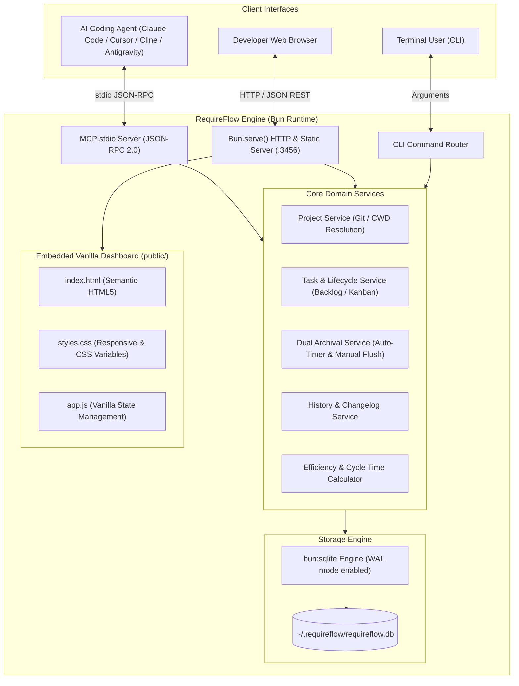

# Design Document: RequireFlow Architecture & Implementation

## 1. System Architecture

RequireFlow is constructed as a modular, single-process application written in **TypeScript** and executed natively on **Bun**. It couples a local SQLite database, an MCP stdio communication bridge, and an embedded Vanilla HTTP server.



---

## 2. Technology Stack Rationale

| Layer | Choice | Rationale |
| :--- | :--- | :--- |
| **Runtime** | **Bun** | Native execution of TypeScript without compilation steps. Cold boot in `< 10ms`. Includes native SQLite and HTTP server out of the box. |
| **Database** | **`bun:sqlite`** | Zero dependencies, zero native compilation flags (`node-gyp`). Built directly into the Bun executable with WAL (Write-Ahead Logging) mode. |
| **Agent Interface** | **MCP (Model Context Protocol)** | Standardized protocol across modern AI coding agents. Operates over standard input/output (`stdio`) for zero-configuration integration. |
| **Web Server** | **`Bun.serve()`** | High performance native HTTP server. Directly serves both REST API endpoints and static assets without requiring Express, Fastify, or external middleware. |
| **Web Dashboard** | **Vanilla HTML5 / CSS / JS** | Instant loading (`< 5ms`), zero npm dependencies, zero webpack/vite build steps, lightweight footprint (`< 50KB` total payload). |
| **Packaging** | **`bun build --compile`** | Can produce a standalone, single binary executable for distribution via Homebrew, GitHub Releases, or direct download. |

---

## 3. Database Schema (`bun:sqlite`)

The database is initialized automatically with WAL mode (`PRAGMA journal_mode = WAL;`) and foreign keys enabled (`PRAGMA foreign_keys = ON;`).

```sql
-- Projects table
CREATE TABLE IF NOT EXISTS projects (
    id TEXT PRIMARY KEY,
    name TEXT NOT NULL,
    description TEXT,
    root_path TEXT,
    archive_threshold_hours INTEGER NOT NULL DEFAULT 24,
    created_at DATETIME NOT NULL DEFAULT (CURRENT_TIMESTAMP),
    updated_at DATETIME NOT NULL DEFAULT (CURRENT_TIMESTAMP)
);

CREATE UNIQUE INDEX IF NOT EXISTS idx_projects_name ON projects(name);
CREATE INDEX IF NOT EXISTS idx_projects_root_path ON projects(root_path);

-- Thematic Sections
CREATE TABLE IF NOT EXISTS sections (
    id TEXT PRIMARY KEY,
    project_id TEXT NOT NULL,
    name TEXT NOT NULL,
    color TEXT DEFAULT '#6366f1',
    position INTEGER NOT NULL DEFAULT 0,
    created_at DATETIME NOT NULL DEFAULT (CURRENT_TIMESTAMP),
    FOREIGN KEY(project_id) REFERENCES projects(id) ON DELETE CASCADE
);

CREATE INDEX IF NOT EXISTS idx_sections_project ON sections(project_id, position);

-- Tasks & Backlog
CREATE TABLE IF NOT EXISTS tasks (
    id TEXT PRIMARY KEY,
    project_id TEXT NOT NULL,
    section_id TEXT,
    title TEXT NOT NULL,
    description TEXT,
    type TEXT NOT NULL CHECK(type IN ('feature', 'fix', 'chore', 'refactor')),
    priority TEXT NOT NULL CHECK(priority IN ('low', 'medium', 'high', 'blocker')) DEFAULT 'medium',
    status TEXT NOT NULL CHECK(status IN ('backlog', 'todo', 'in_progress', 'done', 'archived')) DEFAULT 'todo',
    position INTEGER NOT NULL DEFAULT 0,
    story_points INTEGER,
    started_at DATETIME,
    completed_at DATETIME,
    archived_at DATETIME,
    cycle_time_seconds INTEGER,
    notes TEXT,
    created_at DATETIME NOT NULL DEFAULT (CURRENT_TIMESTAMP),
    updated_at DATETIME NOT NULL DEFAULT (CURRENT_TIMESTAMP),
    FOREIGN KEY(project_id) REFERENCES projects(id) ON DELETE CASCADE,
    FOREIGN KEY(section_id) REFERENCES sections(id) ON DELETE SET NULL
);

CREATE INDEX IF NOT EXISTS idx_tasks_project_status ON tasks(project_id, status);
CREATE INDEX IF NOT EXISTS idx_tasks_section ON tasks(section_id);
CREATE INDEX IF NOT EXISTS idx_tasks_completed_at ON tasks(completed_at);
CREATE INDEX IF NOT EXISTS idx_tasks_archived_at ON tasks(archived_at);
```

---

## 4. The Dual Archival Engine (Kanban to History)

### The "Infinite Done" Problem
In standard Kanban boards, the `Done` column continually accumulates items. For humans, this creates clutter; for AI agents, it wastes context tokens when querying the board.

### The Solution: Active Board vs. Permanent History
RequireFlow implements a dual transition:

```
[ Backlog / To Do ] ────> [ In Progress ] ────> [ Done (Temporary) ]
                                                      │
                       ┌──────────────────────────────┴──────────────────────────────┐
                       │                                                             │
                       ▼                                                             ▼
         Trigger A: Auto-Archival                     Trigger B: Manual Flush
         • Background ticker checks tasks in Done     • User clicks "Archivar Completadas"
         • If (now - completed_at) > threshold_hours  • Or agent calls POST /archive-done
                       │                                                             │
                       └──────────────────────────────┬──────────────────────────────┘
                                                      │
                                                      ▼
                                           [ Archived / History ]
                                       • Permanent audit changelog
                                       • Cycle time calculated & locked
                                       • History search & metrics
```

### Implementation Logic
```typescript
export function archiveDoneTasks(projectId: string, manual: boolean = false): number {
  const db = getDatabase();
  const project = getProject(projectId);
  const thresholdHours = project.archive_threshold_hours || 24;

  let query: string;
  let params: any[];

  if (manual) {
    // Flush all tasks currently in 'done'
    query = `
      UPDATE tasks 
      SET status = 'archived', 
          archived_at = CURRENT_TIMESTAMP,
          updated_at = CURRENT_TIMESTAMP
      WHERE project_id = ? AND status = 'done'
    `;
    params = [projectId];
  } else {
    // Flush only tasks older than threshold
    query = `
      UPDATE tasks 
      SET status = 'archived', 
          archived_at = CURRENT_TIMESTAMP,
          updated_at = CURRENT_TIMESTAMP
      WHERE project_id = ? 
        AND status = 'done' 
        AND completed_at <= datetime('now', '-' || ? || ' hours')
    `;
    params = [projectId, thresholdHours];
  }

  const result = db.prepare(query).run(...params);
  return result.changes;
}
```

---

## 5. Model Context Protocol (MCP) Tools

When `requireflow mcp` is launched by an agent via `stdio`, it registers the following tools:

| Tool Name | Arguments | Description |
| :--- | :--- | :--- |
| `task_next` | `{ projectId?: string }` | Returns the highest priority pending task (`blocker` > `high` > `medium` > `low`) in the active project. |
| `task_start` | `{ id: string }` | Marks task as `in_progress` and records `started_at = now()`. |
| `task_complete` | `{ id: string, notes?: string }` | Marks task as `done`, records `completed_at = now()`, computes `cycle_time_seconds`, and stores solution notes. |
| `task_create` | `{ title: string, type?: string, priority?: string, sectionId?: string, description?: string, storyPoints?: number }` | Creates a new task or bugfix in the backlog. |
| `task_list` | `{ projectId?: string, status?: string, sectionId?: string }` | Lists tasks with optional filters. |
| `task_update` | `{ id: string, title?: string, description?: string, priority?: string, sectionId?: string }` | Updates task metadata. |
| `task_archive_done` | `{ projectId?: string }` | Manually flushes all currently `done` tasks to the permanent `History` archive. |
| `history_list` | `{ projectId?: string, limit?: number, query?: string }` | Retrieves archived completed work for changelogs or context recovery. |
| `efficiency_stats` | `{ projectId?: string }` | Returns average cycle time, completed task count, and throughput metrics. |
| `project_current` | `none` | Returns current project identity detected from `cwd`. |

---

## 6. Local HTTP REST API (Served by Bun)

Served by default on `http://127.0.0.1:3456`:

| Endpoint | Method | Purpose |
| :--- | :---: | :--- |
| `/api/projects` | `GET` | List all local projects. |
| `/api/projects` | `POST` | Create a new project manually. |
| `/api/projects/:id` | `GET` | Get project metadata and summary counters. |
| `/api/projects/:id/sections` | `GET` / `POST` | List or create thematic sections. |
| `/api/projects/:id/board` | `GET` | Get active Kanban columns: `{ todo: [], in_progress: [], done: [] }`. |
| `/api/projects/:id/backlog` | `GET` | Get full backlog list with sorting. |
| `/api/projects/:id/tasks` | `POST` | Add task to backlog. |
| `/api/tasks/:id` | `PATCH` | Update task fields (title, priority, section). |
| `/api/tasks/:id/status` | `PATCH` | Update task status (triggers start/complete timestamps). |
| `/api/tasks/:id/start` | `POST` | Convenience route to start task. |
| `/api/tasks/:id/complete` | `POST` | Convenience route to complete task with notes. |
| `/api/projects/:id/archive-done` | `POST` | Manually archive all `done` tasks to History. |
| `/api/projects/:id/history` | `GET` | List archived tasks with search and pagination. |
| `/api/projects/:id/efficiency` | `GET` | Get efficiency metrics: cycle time, lead time, throughput. |

---

## 7. Embedded Vanilla Web Dashboard

The frontend is served directly from the `public/` directory with zero build dependencies:
- **`public/index.html`**:
  - Semantic structure with header, project selector, quick search, theme toggle, and main navigation.
  - Tabs:
    - **Tablero (Kanban)**: 3 columns (`Por Hacer`, `En Progreso`, `Completadas Recientes`). Includes the `"Archivar al Historial"` action button.
    - **Backlog**: Prioritized list, section chips, quick inline creation form.
    - **Historial**: Chronological table/timeline with search filter, duration tags, and notes modal.
    - **Eficiencia**: KPI cards (Tiempo Promedio de Ciclo, Total Completado, Ratio Features/Fixes) and a clean Vanilla SVG/Canvas velocity chart.
- **`public/styles.css`**:
  - Modern, minimalist aesthetic inspired by Linear and GitHub Primer.
  - Native CSS Variables for smooth Light and Dark theme switching (`prefers-color-scheme` support with manual toggle).
  - Flexbox and CSS Grid layout; zero external CSS frameworks (no Tailwind compilation needed at runtime).
- **`public/app.js`**:
  - Lightweight reactive state management (`< 300` lines of clean ES6).
  - Fetches data from `/api/*` endpoints.
  - Supports drag-and-drop between columns or quick click transitions.

---

## 8. Directory Layout of the Target Project

The target repository should be structured as follows:

```text
requireflow/
├── bin/
│   └── requireflow.ts       # CLI entrypoint executable (#/usr/bin/env bun)
├── src/
│   ├── index.ts             # Main exports
│   ├── config.ts            # Global paths (~/.requireflow) & defaults
│   ├── db/
│   │   ├── connection.ts    # bun:sqlite connection, WAL mode & migrations
│   │   └── schema.ts        # DDL migration scripts
│   ├── services/
│   │   ├── project.service.ts
│   │   ├── task.service.ts
│   │   ├── section.service.ts
│   │   ├── archive.service.ts
│   │   ├── history.service.ts
│   │   └── efficiency.service.ts
│   ├── mcp/
│   │   ├── server.ts        # JSON-RPC 2.0 stdio server
│   │   └── tools.ts         # MCP tool definitions & execution
│   ├── server/
│   │   ├── http.ts          # Bun.serve() routing & static file handler
│   │   └── routes.ts        # REST API controller handlers
│   └── utils/
│       ├── git.ts           # Auto-detection of Git root / directory name
│       └── time.ts          # Cycle time & duration formatters
├── public/
│   ├── index.html           # Vanilla HTML5 dashboard
│   ├── styles.css           # Vanilla CSS (responsive, dark/light)
│   └── app.js               # Vanilla JS client logic
├── tests/
│   ├── db.test.ts
│   ├── task.test.ts
│   ├── archive.test.ts
│   └── mcp.test.ts
├── package.json
├── tsconfig.json
└── README.md
```
